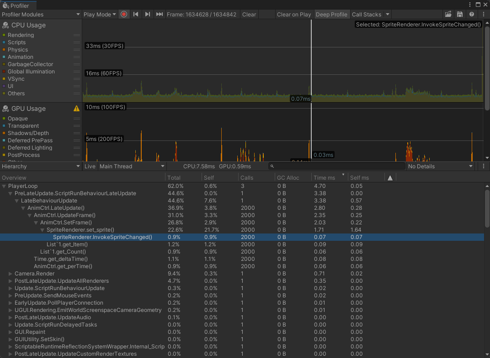
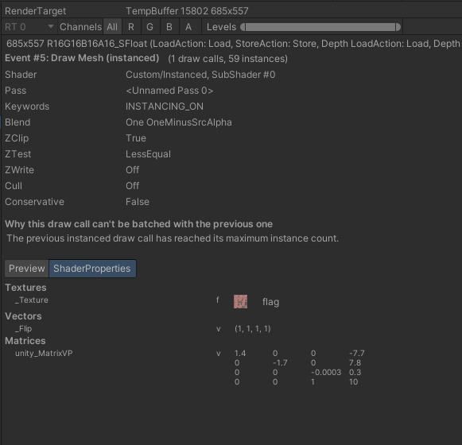

# SpriteRenderer使用GPUInstancing

[相关demo](https://github.com/ysich/UnityMeshGPUInstancing.git)

## 注意事项

### TextureImportSetting

#### MeshType

Sprite图集  MeshType需要为FullRect，这样使用可以使用通用的平面网格，不需要变更uv坐标，缺点就是透明图会增加OverrDraw

如果大量静态图，那么可以把MeshType设置为Tight，然后再用工具导出Sprite图的网格，这样应该是最友好的方式。

如果是动态图类似于帧动画这种，还是FullRect使用平面网格进行设置最为方便。因为如果通过工具来匹配所有图集内精灵图都适用的网格，再设置uv坐标再把数据记录起来，还需要对数据进行一个统一的管理反而麻烦许多。

#### Pixels Per Unit

一个unity单位将显示多少个像素该问题。

比如设置为100，那么128 x 128的纹理 / 100 那么就需要1.28个unity单位才能显示完。

当需要计算出Sprite的Mesh数据时，需要除以 Pixels Per Unit才能得到Unity单位。Mesh都是Unity单位。

## SpriteRenderer

使用精灵图的`Mesh`进行uv的渲染

- 如果是alpha通道分离的图集，那么无法通过sprite图构建出mesh
- 如果是带alpha通道的图集，那么会在赋值时底层通过sprite图的透明信息构建出mesh
  - 如果是帧动画播放，每一帧都会渲染不同的mesh造成消耗。

通过Z轴(相对相机的位置)的顺序来渲染精灵图。

可以使用精灵遮罩

可以进行九宫格切片

Draw Mode

- Simple
  - 不能使用九宫格
  - `SpriteRenderer`会跟随sprite内容做自适应大小。
- Sliced
  - 可以使用九宫格，通过九宫格缩放uv尺寸
  - 不随sprite内容自适应。
- Tiled
  - 使用九宫格的中间部分，在尺寸变化时进行平铺。

## MeshRenderer

[为Unity Sprite实现GPU Instancing (ownself.org)](https://www.ownself.org/2022/unity-sprite-gpu-instancing.html)

一般和`Mesh Fiter`搭配，`Mesh Fiter`负责展示具体的`Mesh`。`MeshRenderer`负责决定怎么渲染这个`Mesh`。

### 使用GPUInstance优化

如果用GPUInstance就得保证mesh是相同的，那么不规则的mesh就满足不了需求了。因为每一帧的sprite都不同，mesh都不同uv也不一定适用。这时候就得使用最通用的四边形mesh了，可以直接使用unity中自带的`Quad`，在shader中根据不同的sprite 对mesh的顶点进行缩放、偏移和uv采样。

这里需要特别注意的是SpriteRenderer中生成的Mesh和Unity内建的Quad的Mesh虽然都是两个三角形，但是顶点和索引的顺序确实完全不同的。


### 网格优化

网格内存 由 Positon、Normal、Tangent、Color、uv1234 组成。

#### Vertex Compression

**每个通道使用 32bit 浮点数保存，如果勾选Vertex Compression则使用16 bit 浮点数保存。**Color 比较特殊，会始终以 4byte 存储。

默认设置的情况下，Position 和 uv1 是不开启的，因为前者需要用于存顶点坐标，后者用于存光照贴图（尺寸往往很大）uv，这两者往往需要更高精度，可结合项目要求决定要不要压缩。

**该选项生效要求网格的前提还有网格不能是动态合批的、不能开启Read/Write、不能开启 Mesh Compression**，此外实际测试发现对蒙皮网格的切线、法线不起作用，但是其他通道有作用，可能是因为这些通道需要参与蒙皮过程。

```c#
//一般2d游戏设置position和uv就可以了，因为也不需要法线和切线
var layout = new[]
{
	new VertexAttributeDescriptor(VertexAttribute.Position, VertexAttributeFormat.Float16,2),
	new VertexAttributeDescriptor(VertexAttribute.TexCoord0,VertexAttributeFormat.Float16,2),
};
var vts = mesh.vertices;
mesh.SetVertexBufferParams(vts.Length,layout);
```

## 测试结果

测试2000个帧动画同时播放，每一帧播放的图片都相同，会与实际项目中复杂的帧动画情况有偏差。

### SpriteRenderer



SpriteRenderer主要的开销在于cpp层的`set_sprite`1.71ms，由于能够使用动态合批，满足条件go可以通过一个drawCall进行渲染。

如果是四边形网格那么动态合批处理起来很快，但是如果Sprite是不规则网格顶点、三角面过多的话耗时会增加不少。

### MeshRenderer


在MeshRenderer中主要耗时在于`MaterialPropertyBlock.SetVector`和`Renderer.SetPropertyBlock`中，其他耗时则可以通过其他方式进行规避，所以可以看出主要都是对渲染参数的传递耗时。

`Object.wbarrier_conc`则是CPU线程等待GPU线程完成写操作的时间。

耗时1.58ms和SpriteRenderer相差不大，但是MeshRenderer的优势在于可以使用相同Mesh，可以使用TextureArrary进行动态的图集合并，进一步优化DrawCall。

### Graphics.DrawMeshInstancedIndirect


使用`DrawMeshInstancedIndirect`进行渲染，在耗时表现上比前面两者优秀很多。但是这里会有个隐藏开销，这里都是渲染同一张图片所以获取Sprite数据的时候只获取了一次，和前面两个获取2000次的结果有偏差。

在实际项目中则是会一直收集变化信息(position、scale等等)，然后在下一帧进行渲染。在每次Update都进行一次`数据设置`和`传递数据给GPU`，会给每一帧施加不少的压力。

### SpriteRenderer和MeshRenderer对比

在渲染600个帧动画的情况下，两者几乎没什么差异，相反MeshRenderer由于需要计算 顶点、uv的偏移和缩放。访问到了`sprite.uv`导致多开辟了空间。


这点也很好优化，把这些计算在生成帧动画图集阶段就可以一起导出到本地。避免运行时访问uv数据。

DrawCall数量上，MeshRenderer会比SpriteRenderer多上一个，无法合批原因为超过实例化多大数（511个）

